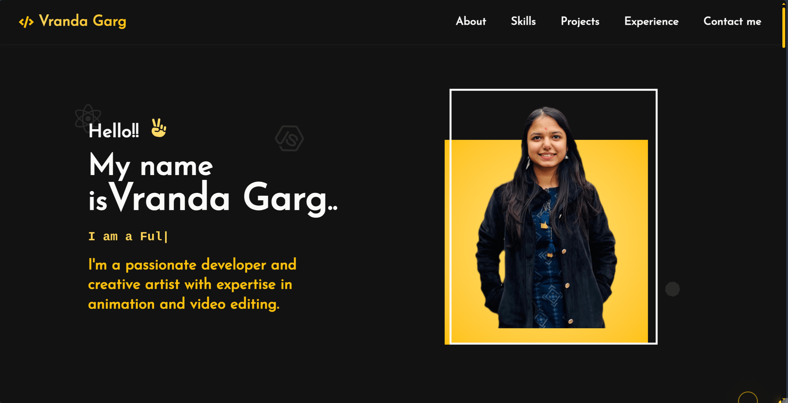

# 🖥️ Vranda Garg - Developer Portfolio

Welcome to my personal developer portfolio website!

## 🚀 Tech Stack
- **Frontend:** React.js
- **Styling:** Tailwind CSS
- **Animations:** Framer Motion

## 🎨 Features
- 👋 Hero section with a dynamic intro and photo
- 🛠️ Skills section showcasing all technologies I’ve worked with
- 📈 GitHub contribution and coding stats visualization
- 📂 Projects section with live demos and code links
- 🏆 Experience & Achievements timeline
- ✉️ Contact form with a friendly "Let’s Connect" layout
- 🖱️ Custom animated cursor and smooth scroll behavior
- 🌙 Dark-themed, modern UI with yellow accents

## 🔗 Live Demo
[Check out the website here](https://vrandagarg.me/) <!-- Replace # with your actual deployed link -->

## 📸 Sneak Peek
 <!-- Replace with actual screenshot if you want -->

## 💡 Inspiration
This portfolio was built to reflect my personality, technical skillset, and creativity in one place. It's a constant work in progress — just like every developer’s journey.

---

Feel free to reach out for collaborations, internships, or just a coffee chat! 🚀✨